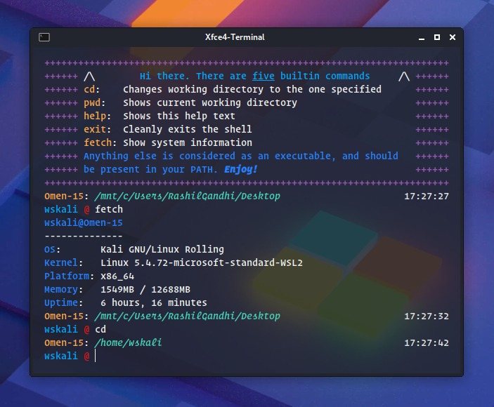

# meta.sh

A tiny shell for Linux, implemented in C++, written as part of my Operating Systems Lab course!





## Features

#### Builtins

The shell has support for the following builtins

- ```cd``` - Change the working directory
- ```pwd``` - Pring the current working directory
- ```help``` - Show a help menu (As shown in the image)
- ```exit``` - Cleanly exit the shell
- ```fetch``` - Show system information


#### Running External Commands

The shell can run executables present in the users PATH. You can execute using the name of the executable or specify the full path


#### Running in background

Processes can be run in background by adding ```&``` at the end of the input. The shell will prompt the next input instead of waiting for the command to finish


#### I/O Redirection

Use the ```<``` symbol to redirect input from a file and the ```>``` symbol to redirect output to a file. For example:

```bash
ls > out.txt
./a.out < in.txt > out.txt
```


#### Piping

There is support for pipes between commands (Any number of pipes). For example:

```bash
ls | more
cat file.txt | grep "somestring" | wc -l > out.txt
```


## Installation/Usage

meta.sh uses the GNU Readline library to add support for history and editing. Please install the library (Called ```libreadline6-dev``` on Debian and derivatives)

After cloning the source code, running ```make``` will build and generate an exectuable called ```shell```

```bash
git clone https://github.com/mukul-mehta/meta.sh.git
cd meta.sh
make
./shell
```


## TODOs

- [ ] Support reading and writing history to a file, using GNU Readline functions

- [ ] Add support for setting and unsetting environment variables

- [ ] Add support for aliases

- [ ] Migrate to C. We aren't really using any C features, other than vectors

- [ ] Support macOS - For now, using some Linux specific headers to fetch sysinfo

